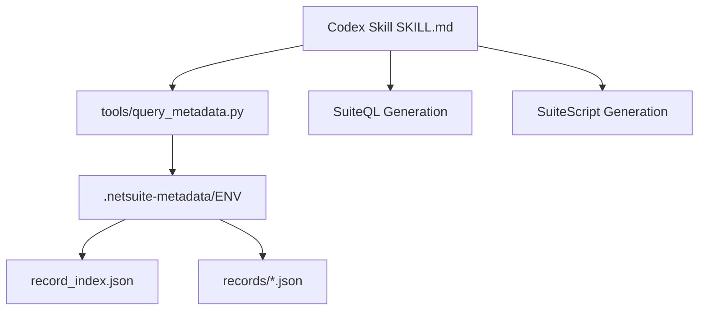

# netsuite-developer  

Deterministic NetSuite development skill for OpenAI Codex in VS Code.

---

## 🚀 Overview

`netsuite-developer` is a metadata-aware development skill designed for NetSuite engineers using OpenAI Codex in VS Code.

It enforces schema validation across:

- SuiteQL
- SuiteScript 2.x
- Saved Searches
- REST integrations
- Custom records and custom fields

This prevents hallucinated fields, invalid joins, and cross-environment drift.

---

## 🔍 Why This Matters

NetSuite development frequently fails due to:

- Assumed field existence
- Guessed join paths
- Environment inconsistency (SB vs QA vs PROD)
- AI-generated schema hallucinations

This skill eliminates those risks by requiring metadata validation before generating schema-dependent logic.

---

## 🧠 What Makes It Different

Unlike generic prompts, this system:

- Requires metadata lookup before scripting
- Enforces explicit environment selection
- Blocks schema-dependent generation without validation
- Outputs JSON-only tool responses
- Generates QA validation plans for non-trivial queries

Metadata becomes the authoritative schema layer.

---

## 🆚 Comparison: Metadata-Driven Skill vs Generic AI Prompts

Most NetSuite + AI workflows rely on increasingly detailed prompts.

Example:

> “Write a SuiteQL query for Sales Orders including tranid, entity, createdfrom, but make sure the field exists.”

This approach depends entirely on the model remembering context correctly.

It does **not** verify schema.

### Generic AI Prompting

- Assumes fields exist
- Guesses joins
- Cannot validate custom fields
- Cannot detect environment differences
- May hallucinate table mappings
- No deterministic enforcement

### netsuite-developer Skill

- Requires metadata lookup before generation
- Validates field existence using exported schema
- Enforces explicit environment selection
- Blocks schema-dependent logic if validation fails
- Produces JSON-only helper outputs
- Generates QA validation steps automatically

This is the difference between:

- Prompt tuning  
and  
- Engineering constraints

Metadata becomes the source of truth.

AI becomes the assistant — not the guesser.

---

## 🏗 Architecture

---

## ⚙ Installation

### Requirements

- Python 3.9+
- VS Code
- OpenAI Codex Extension

### Setup

1. Place `SKILL.md` into:

   `<project-root>/.codex/skills/netsuite-developer/`

2. Place helper into:

   `<project-root>/tools/query_metadata.py`

3. Add metadata exports to:

   `<project-root>/.netsuite-metadata/<ENV>/`

4. Restart VS Code

---

## 💻 Example Usage

List records:

    python tools/query_metadata.py --env QA list-records

Find a field:

    python tools/query_metadata.py --env QA find-field createdfrom

Suggest SuiteQL baseline:

    python tools/query_metadata.py --env QA suggest-suiteql salesorder --fields tranid,entity,createdfrom

---

## 🎯 Target Audience

- NetSuite Developers
- SuiteApp Providers
- NetSuite Consulting Firms
- AI-Assisted ERP Engineering Teams
- Specification-Driven Development Practitioners

---

## 📈 SEO Keywords

NetSuite AI development, NetSuite Codex integration, SuiteQL validation tool, SuiteScript metadata validation, NetSuite schema-aware AI, ERP AI engineering, OpenAI Codex NetSuite workflow.

---

## 📜 License

- SKILL.md → Creative Commons Attribution 4.0 (CC-BY-4.0)
- query_metadata.py → MIT License

---

## 👤 Author

Joshua Meiri  
Origami Precision, LLC  

Built for disciplined, metadata-driven NetSuite engineering workflows.
