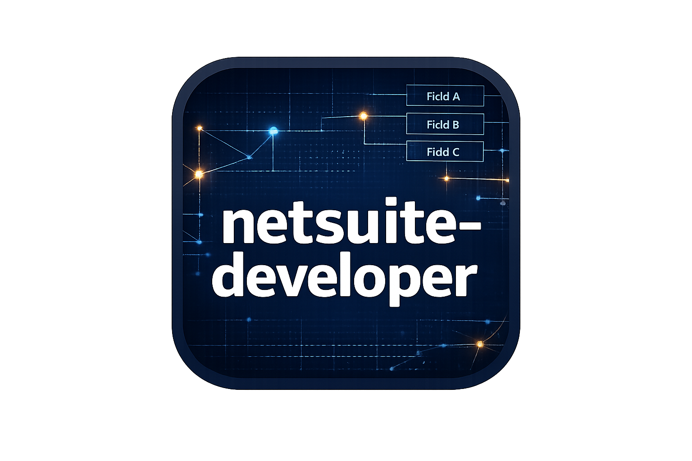
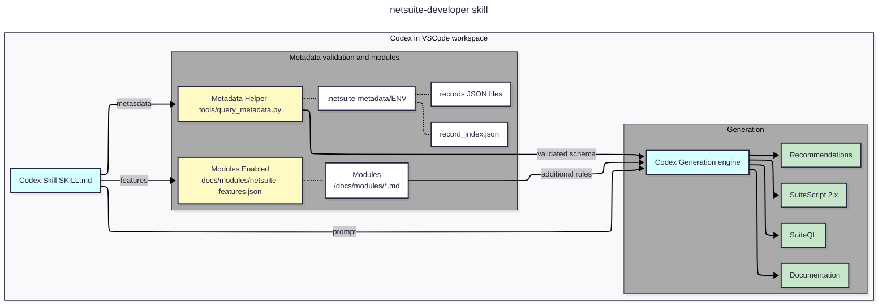

# netsuite-developer  

  

Deterministic AI constraint layer for NetSuite development in OpenAI Codex.

---

## Overview

`netsuite-developer` is not a prompt.

It is a rule system for AI-assisted NetSuite engineering.

This Codex Skill enforces deterministic behavior when generating:

- SuiteScript 2.x
- SuiteQL
- Saved Searches
- REST integrations
- Custom record logic
- Custom field interactions

It introduces engineering constraints into AI workflows so NetSuite development remains safe, structured, and environment-aware.

---

## Engineering Foundations

This Skill aligns with the principles defined in the [NetSuite Engineering Constitutions](https://github.com/joshOrigami/netsuite-engineering-constitutions), a Specification-Driven Development (SDD) baseline for SuiteScript and integration discipline.

The Constitutions define non-negotiable invariants for NetSuite systems.  
This Skill operationalizes those invariants inside AI-assisted development workflows.

The Constitutions define the doctrine.  
The Skill enforces the discipline.

---

## The Problem

AI can write NetSuite code.

But AI does not know:

- Your custom fields
- Your record structure
- Your sublists
- Your environment differences (SB, QA, PROD)
- Your governance standards

Without constraints, AI guesses.

In ERP systems, guessing is expensive.

---

## What This Skill Enforces

### Engineering Guarantees

When active, this skill enforces:

- Explicit environment selection
- No hallucinated field IDs
- No guessed joins
- No silent try/catch blocks
- Docstrings on all functions
- Comments on complex logic
- QA validation steps for non-trivial SuiteQL
- Schema validation before generating record-dependent logic

This is deterministic AI behavior — not prompt tuning.

### Operational Readiness Requirements

In addition to code discipline, the skill now requires:

- UAT Guides for non-trivial changes
- Installation / Deployment / Admin Guides
- Explicit error identification and handling documentation
- End User Guides when behavior changes impact users
- Rollback considerations

Engineering completeness includes operational clarity.

---

## Metadata Is a Tool, Not the Product

When metadata is available, the skill requires validation before generating schema-dependent logic.

Metadata becomes one enforcement mechanism within the system.

The skill governs behavior.

### Bring Your Own Metadata

The metadata provider can be:

- [origami lens](https://origamilens.com) by Origami Precision, LLC
- A custom export process
- Manually curated schema files

The skill works independently.  
Metadata strengthens enforcement.

---

## Bring Your Own Modules

This project supports optional feature modules that extend the core Skill.

Modules live under:

    docs/modules/

Feature enablement is declared in:

    docs/modules/netsuite-features.json

Modules may be:

- Public and committed to this repository
- Proprietary and internal to your organization
- Client-specific and not shared publicly

See:

    docs/BYO_MODULE.md

When modules are enabled for an environment, non-trivial scripts must include a Module Applicability declaration.

---

## Comparison: Constraint System vs Generic Prompting

Most NetSuite + AI workflows rely on better prompting.

Example:

> Write a Map/Reduce script to update custbody_margin on Sales Order.

Generic AI may:

- Assume the field exists
- Guess whether it is body or line level
- Skip environment validation
- Swallow errors silently

With `netsuite-developer` active:

- Field existence must be validated
- Record structure must be confirmed
- Environment must be explicit
- Error handling must be reviewable
- QA plan must be included when required

This is the difference between:

Prompt engineering  
and  
Engineering constraints

---

## Architecture

The metadata helper is folded into the constraint system.

It is an enforcement mechanism — not the core identity of the project.

---

## Bring Your Own Metadata

This project is provider-neutral.

If you have a NetSuite schema export that conforms to the metadata contract, the skill can use it to enforce deterministic behavior.

- Contract: `docs/BYO_METADATA.md`
- The helper reads from: `.netsuite-metadata/<ENV>/`

[origami lens](https://origamilens.com/) can export a compatible schema package, but the skill works with any compatible schema export.

---

## Installation

### Requirements

- Python 3.9+
- VS Code
- OpenAI Codex Extension

### Setup

1. Place `SKILL.md` into:

   `<project-root>/.codex/skills/netsuite-developer/`

2. Place helper into:

   `<project-root>/tools/query_metadata.py`

3. Add metadata exports to:

   `<project-root>/.netsuite-metadata/<ENV>/`

4. Add modules to:

   `<project-root>/docs/modules/`

5. Restart VS Code

---

## Example Usage

Validate record schema:

    python tools/query_metadata.py --env QA get-record salesorder

Find a field across records:

    python tools/query_metadata.py --env QA find-field createdfrom

Suggest a baseline SuiteQL query:

    python tools/query_metadata.py --env QA suggest-suiteql salesorder --fields tranid,entity,createdfrom

---

## Target Audience

- NetSuite Developers
- Consulting Firms
- SuiteApp Providers
- AI-Assisted ERP Engineering Teams
- Specification-Driven Development practitioners

---

## SEO Keywords

NetSuite AI engineering, deterministic AI NetSuite, SuiteScript validation, SuiteQL schema enforcement, NetSuite AI constraints, OpenAI Codex NetSuite workflow, ERP AI safety.

---

## License

- SKILL.md → Creative Commons Attribution 4.0 (CC-BY-4.0)
- tools/query_metadata.py → MIT License

---

## Author

Joshua Meiri  
Origami Precision, LLC  

Built for disciplined, deterministic NetSuite AI engineering.

---

## Attribution

Third-party trademarks mentioned in this document are the property of their respective owners.

NetSuite and Oracle are registered trademarks of Oracle Corporation.  
Codex is a trademark of OpenAI.  
Visual Studio Code and Microsoft are trademarks of Microsoft Corporation.
