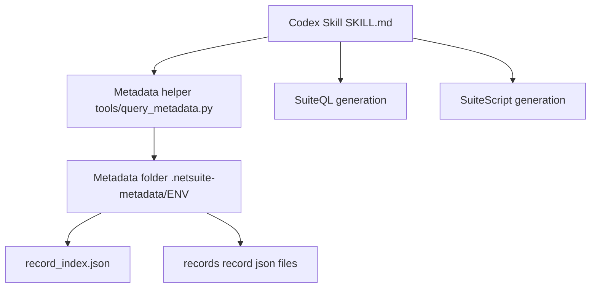

# Architecture

This repository provides a Codex skill for disciplined NetSuite development, plus a small local metadata helper.

The design goal is deterministic behavior:

- No hallucinated fields
- No guessed joins
- No implicit environment selection
- JSON-only tool outputs

## Components

- `SKILL.md`
  - Loaded by the OpenAI Codex extension in VS Code
  - Defines behavioral constraints and workflow rules
  - Requires schema lookup through the metadata helper when metadata is present

- `tools/query_metadata.py`
  - Local helper CLI used by Codex and developers
  - Reads exported metadata files from `.netsuite-metadata/<ENV>/`
  - Outputs JSON only

- `.netsuite-metadata/<ENV>/`
  - Metadata export directory created by Origami Lens or another provider
  - One folder per environment, name is arbitrary
  - Example environment names: SB, QA, PROD, UAT, CLIENTA-PROD

## High-Level Flow

## Environment Selection

Environment selection is explicit.

Rules:

- If multiple environment folders exist under `.netsuite-metadata/`, the user must choose one.
- The helper is invoked with `--env <ENV_FOLDER_NAME>` or the project provides `.netsuite-metadata/active_env.json`.
- The selected environment must be echoed in all schema-dependent responses.

## Metadata Contract Expectations

The helper expects, per environment folder:

- `record_index.json`
- `records/<record>.json`

A provider may also include `manifest.json`, but the helper does not require it.

## Helper Commands

Common commands:

- List records

    python tools/query_metadata.py --env QA list-records

- Get a record definition

    python tools/query_metadata.py --env QA get-record salesorder

- List fields for a record

    python tools/query_metadata.py --env QA list-fields salesorder

- Find a field across records

    python tools/query_metadata.py --env QA find-field createdfrom

- Suggest a baseline SuiteQL query

    python tools/query_metadata.py --env QA suggest-suiteql salesorder --fields tranid,entity,createdfrom

## Safety and Determinism

When metadata exists:

- Use it.
- Do not invent missing fields.
- Do not guess join paths.
- If the helper reports an error, stop and resolve before continuing.

When metadata does not exist:

- Ask clarifying questions before generating schema-dependent logic.

## Recommended Repository Layout

This repository is intended to be copied into a developer workspace like this:

    <project-root>/
      .codex/skills/netsuite-developer/SKILL.md
      tools/query_metadata.py
      .netsuite-metadata/<ENV>/...

